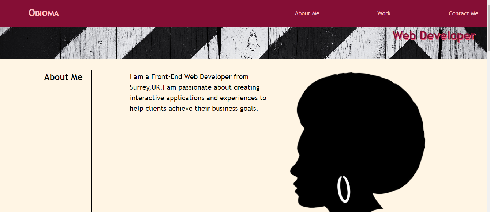

# Obioma's Portfolio Page
A project to develop a responsive webpage using web layout models and media queries.

## Description
Obioma's Portfolio Page is developed using the Flexbox web layout and media queries so that the webpage can render well on all screen sizes and resolutions while ensuring a good user experience.

## Screenshot

## Link to website
[Obioma's Portfolio Page](https://obeeyoma.github.io/horiseon-code-refactor-challenge/)
